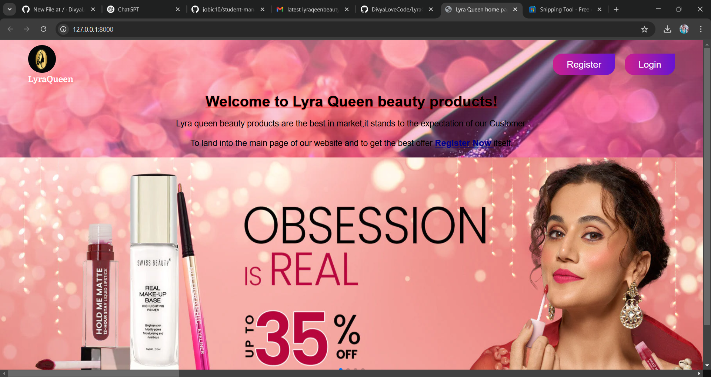
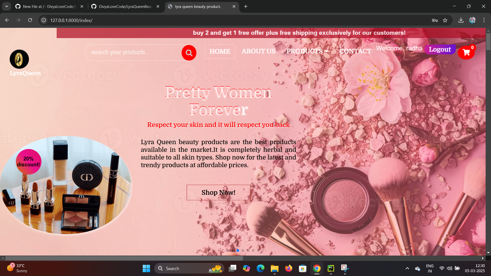
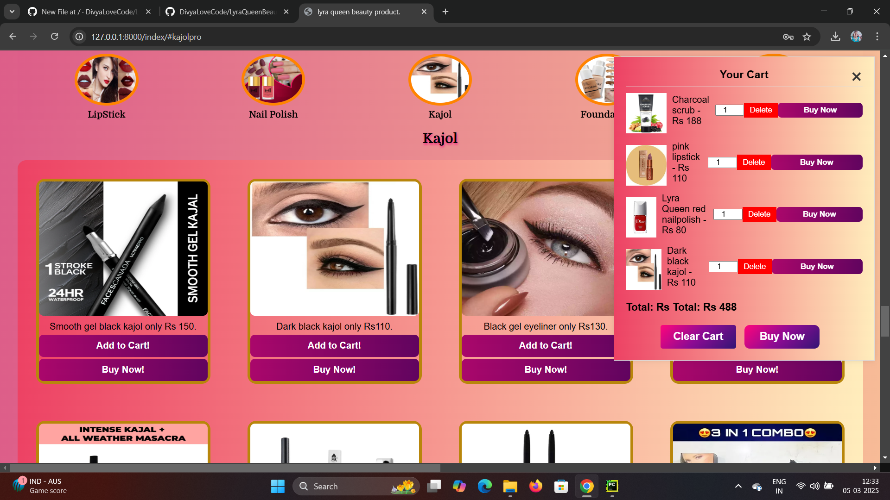
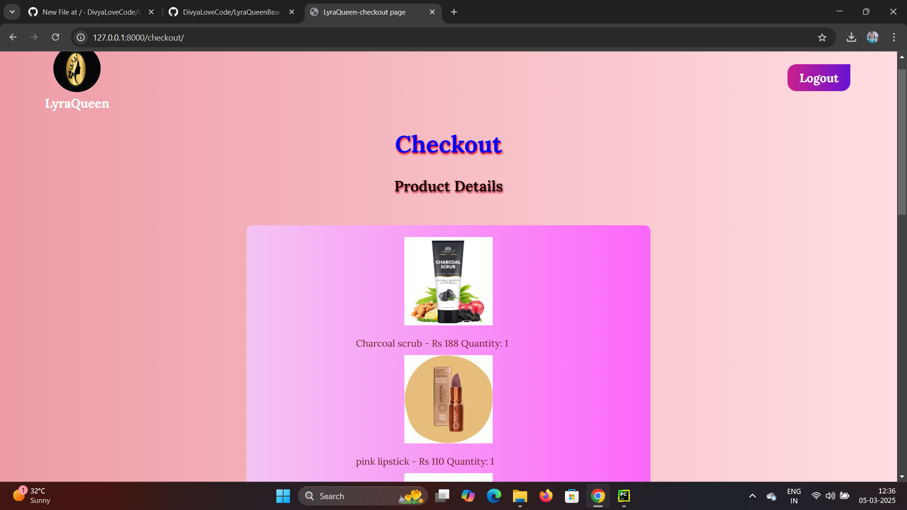
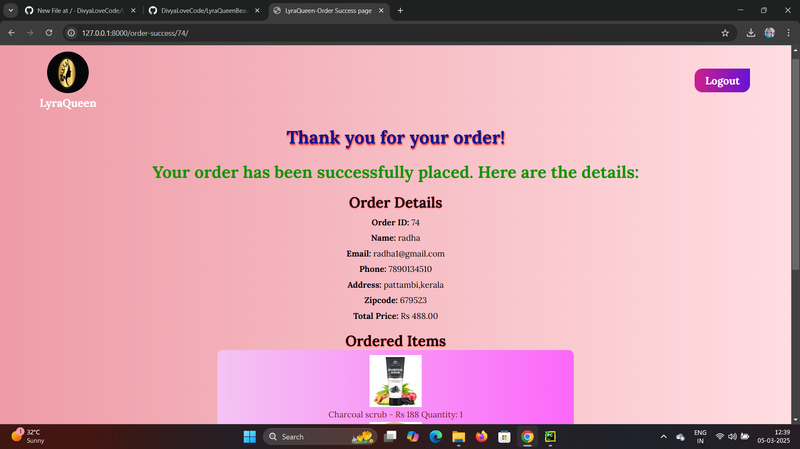

# BeautyProduct Full Stack E-Commerce Website
## This is a full-stack e-commerce application for beauty products built using Python, Django, PostgreSQL, and integrates frontend technologies such as HTML, CSS, and JavaScript. The website allows users to browse products, create an account, add products to a shopping cart, and make payments via Razorpay.

# DEPLOYED TO:
## https://lyraqueenbeautyproduct.onrender.com/

#SCREENSHOT

# Features
## User Authentication: Users can sign up, log in, and manage their account through authentication and session management.
## Product Display: A variety of beauty products (lipstick, nail polish, foundation, eyeshadow, kajal, mascara) are displayed, with the option to add them to the shopping cart.
##Cart Management: Users can add products to the cart, view item details such as image, price, and quantity, and proceed to checkout.
##Checkout & Order Details: Users can fill in shipping details and proceed with purchasing through a Razorpay payment gateway.
##Order Confirmation: After a successful payment, users are redirected to an order confirmation page with order details and shipping information.
##Responsive UI: The application is designed to be responsive across different devices.
# Technologies Used
## Backend:
### Python
### Django
### PostgreSQL
## Frontend:
### HTML
### CSS
### JavaScript
## Payment Gateway:
### Razorpay (Testing mode)
## Hosting:
### Render.com

# Getting Started
## To run this project locally on your machine, follow these steps:

# Prerequisites
## Make sure you have the following installed:
### Python (>=3.6)
### django
### PostgreSQL
### Git

# Installation:
 ## 1 Clone the repository:
 ### git clone https://github.com/DivyaLoveCode/LyraQueenBeauty.git
 ## 2 Navigate into the project directory:
  ### cd BeautyEcommerce
 ## 3 Create and activate a virtual environment:
 ### python -m venv venv
  ### venv\Scripts\activate
## 4 Install the required dependencies:
  ### pip install -r requirements.txt
## 5 Set up the PostgreSQL database:

## 6 Create a new database in PostgreSQL and update the database credentials in the settings.py file.
 ## Run the database migrations
  ### python manage.py migrate
## 7 Create a superuser to access the admin panel (optional, for managing content):
## 8 Run the server locally:
###  python manage.py runserver
## 9 Open your browser and go to:
  ### http://127.0.0.1:8000/

# Usage
## On the homepage, you will find buttons to sign up or log in.
## After signing up, users can browse and add beauty products to their cart.
## When the cart is ready, proceed to checkout and enter product details.
## After confirming payment via Razorpay (in testing mode), the order will be placed successfully.
## You can view the status of your order on the confirmation page.

# Acknowledgements
## Razorpay: For the payment gateway integration.
## Django: For making backend development easy and efficient.
## PostgreSQL: For the relational database.

